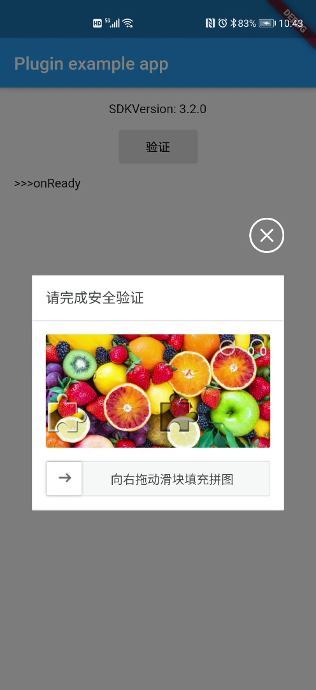
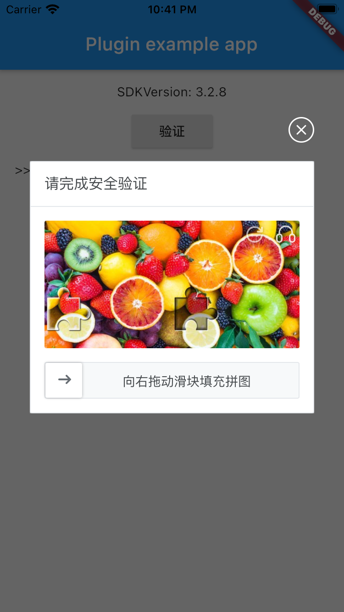

# flutter_yidun_captcha

[![pub version][pub-image]][pub-url]

[pub-image]: https://img.shields.io/pub/v/flutter_yidun_captcha.svg
[pub-url]: https://pub.dev/packages/flutter_yidun_captcha

适用于 Flutter 的网易易盾行为式验证码插件

---

<!-- START doctoc generated TOC please keep comment here to allow auto update -->
<!-- DON'T EDIT THIS SECTION, INSTEAD RE-RUN doctoc TO UPDATE -->

- [屏幕截图](#%E5%B1%8F%E5%B9%95%E6%88%AA%E5%9B%BE)
- [快速开始](#%E5%BF%AB%E9%80%9F%E5%BC%80%E5%A7%8B)
  - [安装](#%E5%AE%89%E8%A3%85)
  - [用法](#%E7%94%A8%E6%B3%95)
    - [获取 SDK 版本](#%E8%8E%B7%E5%8F%96-sdk-%E7%89%88%E6%9C%AC)
    - [开始验证](#%E5%BC%80%E5%A7%8B%E9%AA%8C%E8%AF%81)
- [相关链接](#%E7%9B%B8%E5%85%B3%E9%93%BE%E6%8E%A5)
- [许可证](#%E8%AE%B8%E5%8F%AF%E8%AF%81)

<!-- END doctoc generated TOC please keep comment here to allow auto update -->

## 屏幕截图

<div>
  
  
</div>

## 快速开始

### 安装

将此添加到包的 pubspec.yaml 文件中：

```yaml
dependencies:
  flutter_yidun_captcha: ^0.1.0
```

或

```yaml
dependencies:
  flutter_yidun_captcha:
    git:
      url: https://github.com/leanflutter/flutter_yidun_captcha.git
      ref: main
```

### 用法

#### 获取 SDK 版本

```dart
String sdkVersion = await YidunCaptcha.sdkVersion;
```

#### 开始验证

```dart
YidunCaptchaConfig config = YidunCaptchaConfig(
  captchaId: '<captchaId>',
  // mode: 'MODE_INTELLIGENT_NO_SENSE',
  timeout: 6000,
  languageType: 'LANG_ZH_CN',
);
await YidunCaptcha.verify(
  config: config,
  onReady: () {
    _addLog('onReady', null);
  },
  onValidate: (dynamic data) {
    _addLog('onValidate', data);
  },
  onClose: (dynamic data) {
    _addLog('onClose', data);
  },
  onError: (dynamic data) {
    _addLog('onError', data);
  },
);
```

## 相关链接

- https://support.dun.163.com/documents/15588062143475712?docId=150442945983729664
- https://support.dun.163.com/documents/15588062143475712?docId=150442931089756160

## 许可证

[MIT](./LICENSE)
